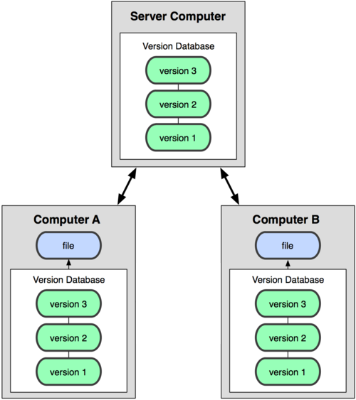

!SLIDE title-slide
# Git & WordPress #

!SLIDE subsection
# Git #

!SLIDE bullets
# Secciones #
* Control de versiones
* Referencias
* Git: Instalación
* Git: Comandos
* Git: Flujo de trabajo
* GitHub
* Conflictos
* Git & WordPress

!SLIDE subsection
# Control de Versiones #

!SLIDE
# Versiones locales #

!SLIDE
# Versiones en el servidor #

!SLIDE
# Versiones en todos sitios #

!SLIDE subsection
# Referencias #

!SLIDE bullets
# Referencias #
* [gitref.org](http://gitref.org/)
* [git-scm.com/book/en/Getting-Started](http://git-scm.com/book/en/Getting-Started)
* [help.github.com](http://help.github.com/)

!SLIDE subsection
# Git: instalación #

!SLIDE
# Instalación #
* Mac: [help.github.com/mac-set-up-git/](http://help.github.com/mac-set-up-git/)
* Win: [help.github.com/win-set-up-git/](http://help.github.com/win-set-up-git/)
* Linux: [help.github.com/linux-set-up-git/](http://help.github.com/linux-set-up-git/)

!SLIDE
# Un último paso #
    
    @@@ shell
    git config branch.autosetuprebase always

!SLIDE subsection
# Comandos #

!SLIDE code
# Mi primer repositorio #
    @@@ shell
    mkdir myrepo # md for win
    cd myrepo
    git init
    
!SLIDE
# Mi primer commit #
    @@@ shell
    vim Readme # (mate, nano, edit...)
    git status
    git add
    git commit -m 'Add readme file'

!SLIDE

!SLIDE
# Modifiquemos Readme #
    @@@ shell
    vim Readme # (mate, nano, edit...)
    git status

!SLIDE
# Añadamos el cambio a stage #
    @@@ shell
    git add
    git status

!SLIDE
# Confirmemos el cambio #
    @@@ shell
    git commit
    git status

!SLIDE
# Branches / ramas #
    @@@ shell
    git checkout -b test
    git branch -a
    git status

Haz al menos dos commits en la branch test

!SLIDE
# ¿Qué pasa con master?
    @@@ shell
    git checkout master
    git log
    git checkout test
    git log

!SLIDE
# Merge / Unir #
    @@@ shell
    git checkout master
    git merge test
    git log

!SLIDE
# Borrar una branch #
    @@@ shell
    git branch -d test

!SLIDE subsection
# Flujo de trabajo #

!SLIDE
# Workflow #

* Crear una topic-branch
* Trabajar en la topic-branch
* Merge master en la topic branch
* Merge topic en master
* Borrar la topic branch

!SLIDE subsection
# GitHub #

!SLIDE
# Compartir código #
Crea un repositorio en [github.com](http://github.com)

!SLIDE
# Repositorio remoto #
    @@@ shell
    git remote add origin git@github.com:...

# Comparte el código #
    @@@ shell
    git push -u origin master

!SLIDE
# Remoto vs Local #

!SLIDE subsection
# Conflictos #

!SLIDE
# Cómo se resuelve un conflicto #
    
    @@@ shell
    <<<<<<< HEAD:file.txt
    Hello world
    =======
    Goodbye
    >>>>>>> 77976d:file.txt

!SLIDE subsection
# Wordpress #

!SLIDE
# Git & WordPress #

* Instala wordpress en tu máquina
* Crea un repositorio solo del tema
* Comparte ese tema

